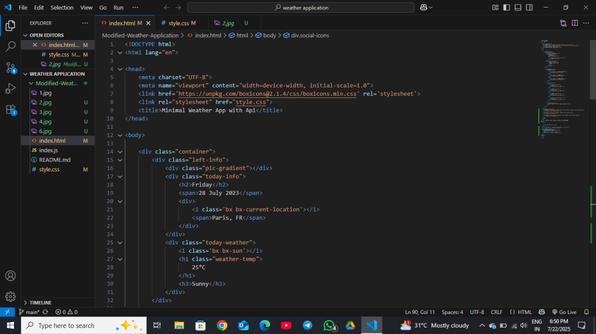
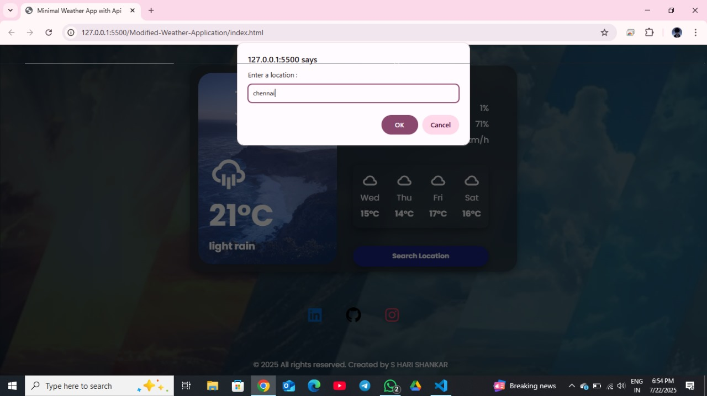
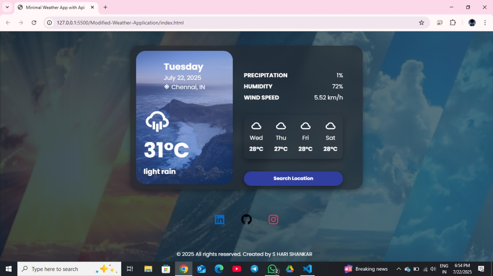
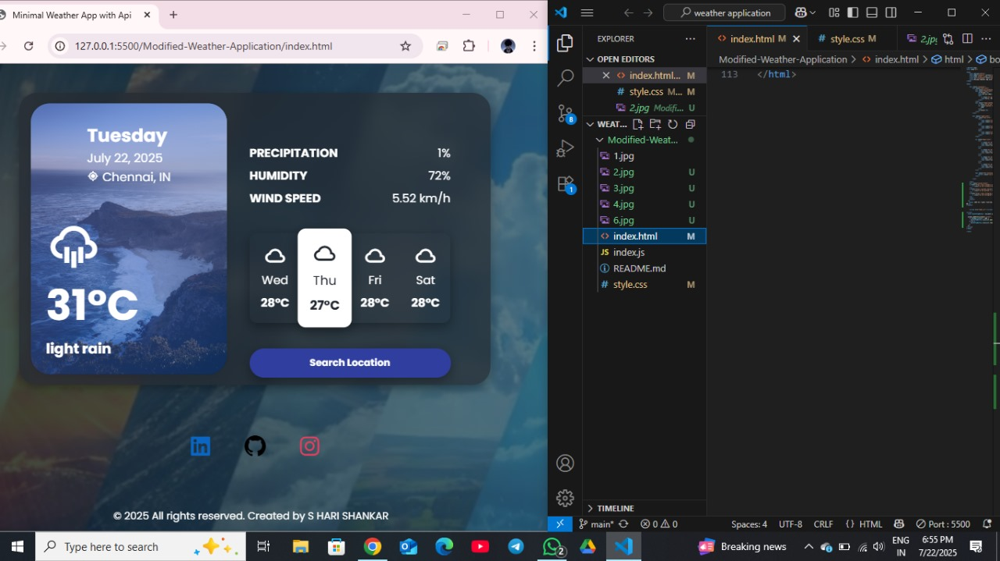

# CODE REFACTORING AND PERFORMANCE OPTIMISATION

*COMPANY* : CODETECH IT SOLUTIONS

*NAME* : S HARI SHANKAR

*INTERN ID* : CT04DH297

*DOMAIN* : SOFTWARE DEVELOPMENT

*DURATION* : 4 WEEKS

*MENTOR* : NEELA SANTHOSH

# 🌦 Modified Weather Application (Web Version)

> ✅ *Task 4

> 📁 Category: UI Enhancement and Code Optimization of an Open-Source Weather Web App  
>
> 🛠 Tech Stack: HTML, CSS, JavaScript , OpenWeatherMap API

## 📌 Project Objective

The goal of this task was to *refactor and improve* an existing open-source weather application for better aesthetics, usability, and design responsiveness.

The modifications were focused purely on:
- index.html
- style.css

This ensures that the core functionality and API integration remain untouched while the user experience and UI quality are significantly enhanced.

## 🛠 Technologies Used

| Frontend | APIs | UI Libraries |
|----------|------|--------------|
| HTML5    | OpenWeatherMap API | Boxicons |
| CSS3     | –    | Google Fonts |

## 🎯 Key Modifications & Enhancements

### ✅ 1. Layout & Responsiveness
- Restored original centered alignment of the weather box.
- Ensured the weather box remains centered even after footer addition.
- Fixed CSS alignment issues from earlier broken layouts.
  

### ✅ 2. *Footer Implementation*
- Added a minimal, centered footer at the *bottom of the page*.
- Footer appears *only after scrolling* (not fixed), for clean UX.
  

### ✅ 3. *Social Media Icons with Links*
- *LinkedIn*: Added with official blue color theme.
- *GitHub*: Added with black theme.
- *Instagram*: Added with gradient color referring to official branding.
- All icons are *clickable* and open in new tabs.
  

### ✅ 4. *Polishing UI Consistency*
- Ensured iconography (Boxicons) is consistent.
- Fonts and padding across sections adjusted via style.css.
  

## 📸 Screenshots

|  

| 

|  

|  

|  

## 🔗 Developer Contact

- 👨‍💻 *Name:* S HARI SHANKAR  
- 📫 *Email:* hari.240123@cse.ritchennai.edu.in  
- 📍 *Location:* Chennai, Tamil Nadu  
- 🔗 [LinkedIn](https://www.linkedin.com/in/s-hari-shankar-27279732b)  
- 🖥 [GitHub](https://github.com/harimadav)  
- 📷 [Instagram](https://www.instagram.com/shankar_s.hari)

## ✅ Conclusion

This task demonstrates the ability to modify UI, enhance design, and maintain application integrity.  
It showcases attention to detail, CSS debugging, responsive design, and clear file organization.

> ✨ Thank you for reviewing my work. Feedback is welcome!

